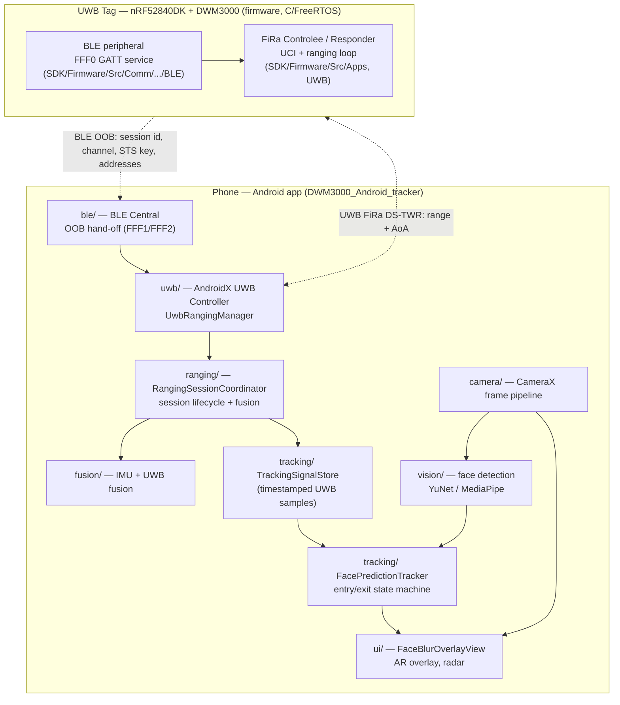

# System Architecture

> Privacy-aware UWB face-blur system. A phone ranges against a UWB tag (an nRF52840 + DWM3000
> board) carried by a person, associates that tag to the person's face in the camera image, and
> pixelates the matched face in real time.

Related docs: [SYSTEM_OVERVIEW.md](SYSTEM_OVERVIEW.md) (BLE OOB contract + FiRa params),
[INTEROP_NOTES.md](INTEROP_NOTES.md) (AOSP interop fixes), [DATA_FLOW.md](DATA_FLOW.md) (runtime
data flow + entry/exit state machine), [BASELINE.md](BASELINE.md) (reproducible baseline + core
vs. experimental inventory).

## 1. High-level component diagram

## 2. The sensing pipeline (stages)

| Stage | Responsibility | Where |
|-------|----------------|-------|
| **1. UWB data acquisition** | Start a FiRa session against the tag; receive `RangingResult` (distance + azimuth + elevation) per peer. | `uwb/UwbRangingManager.kt`, `ranging/RangingSessionCoordinator.kt` |
| **2. Signal preprocessing** | Timestamp every measurement, keep a short per-peer history, expose frame-aligned snapshots; EMA depth smoothing; IMU/UWB fusion. | `tracking/TrackingSignalStore.kt`, `fusion/`, `FacePredictionTracker.updateDepthEstimateLocked` |
| **3. Localization** | Project a peer's (range, AoA) into the camera image plane (parallax + camera-roll corrected), and estimate expected face height from depth. | `FacePredictionTracker.projectUwbToImage / estimateFaceHeightPx` |
| **4. Tracking & association** | Detect faces (CNN @ ~5 Hz), propagate between detections (IMU + KLT @ 20–30 FPS), assign face track IDs, and run the per-person **entry/exit state machine** binding each UWB peer to a face. | `vision/`, `tracking/FaceRoiTracker.kt`, `tracking/FacePredictionTracker.kt` |
| **5. Visualization & output** | Pixelate the faces marked `privacyTarget`, draw HUD/labels, radar and AR overlays; structured transition log. | `ui/FaceBlurOverlayView.kt`, `ui/ArOverlayView.kt`, `ui/RadarView.kt`, `tracking/TrackEventLog.kt` |

## 3. Module interfaces (key contracts)

- **`UwbRangingManager`** → emits `RangingData(peerAddress, distanceMeters, azimuthDegrees,
  elevationDegrees, measurementTimeNs)` and an `onPeerDisconnected(addr)` callback.
- **`RangingSessionCoordinator`** → owns session generation/lifecycle; forwards raw updates to
  `TrackingSignalStore.updateUwb(...)` and peer loss to `onPeerLost` →
  `TrackingSignalStore.clearPeer(addr)`.
- **`TrackingSignalStore`** → `snapshot()` (latest-per-peer = *live peers*), `snapshotAt(frameNs)`
  (frame-aligned samples within tolerance), `sampleForPeer(...)`. This is the single source of
  truth for "which peers currently have UWB".
- **`FacePredictionTracker`** → `onCnnResult(faces, frameNs, w, h)` (fresh detections) and
  `predictForFrame(frameNs, bitmap)` → `FaceTrackingPrediction(faces, ...)`. Each returned
  `DetectedFace` carries an optional `FaceUwbAssociation(state, confidence, privacyTarget, ...)`.
- **`FaceBlurOverlayView`** → `updateDetections(bitmap, faces, stats)`; blurs exactly the faces
  where `uwbAssociation.privacyTarget == true`.
- **`TrackEventLog`** → `record(TrackEvent)`; Logcat tag `TrackEvent` + in-memory ring buffer.

## 4. Why blur is keyed on `privacyTarget`

The whole privacy decision collapses to one boolean per face: `FaceUwbAssociation.privacyTarget`.
The tracker sets it `true` only for a **CONFIRMED** owner lock and keeps it `true` through transient
camera occlusion (**VISUAL_LOST / REACQUIRING**) and transient UWB loss (**COASTING**). The overlay
has no policy of its own — it simply blurs every `privacyTarget` face. See
[DATA_FLOW.md](DATA_FLOW.md) for the full state machine.
