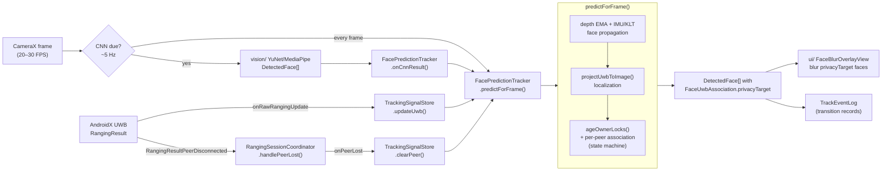
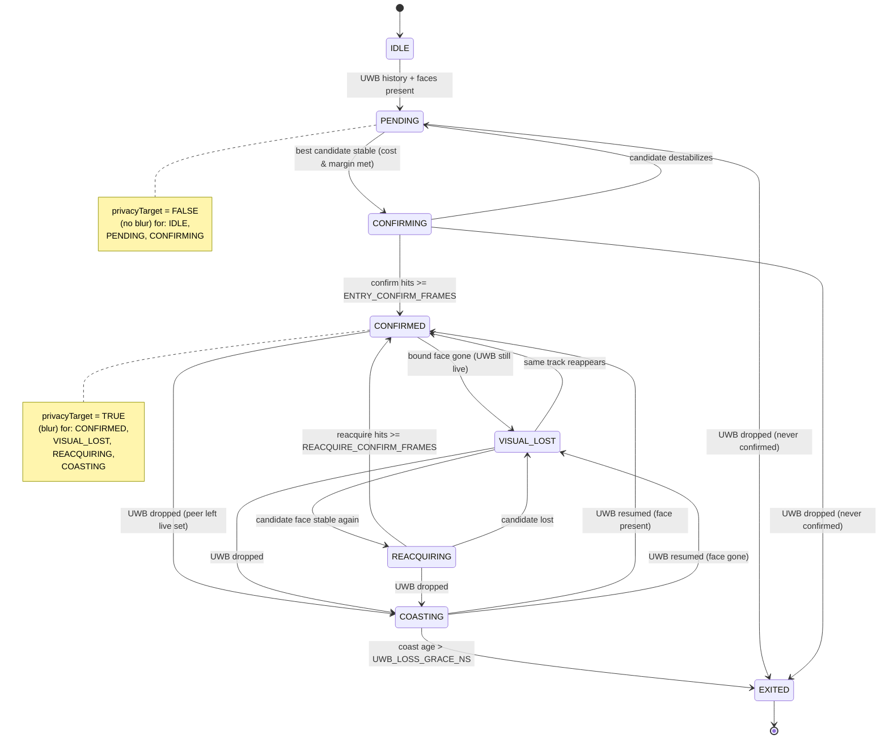

# Data Flow & Entry/Exit Protocol

This document describes the runtime data flow from a UWB measurement to a blurred face, and the
**deterministic entry/exit state machine** that governs how a person is added to and removed from
the tracking system. See [ARCHITECTURE.md](ARCHITECTURE.md) for the static component view.

## 1. Runtime data flow

Key timing: face detection (CNN) runs at ~5 Hz to save energy; between detections the face boxes
are propagated every camera frame (20–30 FPS) using IMU ego-motion + sparse KLT optical flow, with
the smoothed UWB range used as a depth/scale prior. The association state machine runs once per
`predictForFrame`.

## 2. Entry/Exit state machine (per UWB peer)

Each UWB peer (a person with a tag) owns one `OwnerLock` whose `state` follows this lifecycle.
A peer is **blurred only when its lock would mark the face `privacyTarget = true`** — shown below.
A standalone rendered version (Graphviz SVG/PNG + Mermaid source) lives in
[diagrams/](diagrams/README.md).

### State definitions

| State | Phase | Meaning | Blur? |
|-------|-------|---------|:-----:|
| `IDLE` | — | Peer known, no face bound. | no |
| `PENDING` | Detection | UWB live, accumulating association pairs; no stable candidate yet. | no |
| `CONFIRMING` | Confirmation | A stable best candidate; counting consecutive confirm frames (false-positive filter / stable init). | no |
| `CONFIRMED` | Tracking | Confirmed person↔tag binding. | **yes** |
| `VISUAL_LOST` | Tracking | Bound face occluded/lost, UWB still live. | yes (fail-safe) |
| `REACQUIRING` | Tracking | Candidate face reappeared, confirming re-lock. | yes |
| `COASTING` | Exit (grace) | UWB dropped out; blur kept on last/predicted face for the grace window. | **yes** |
| `EXITED` | Removal | Person declared left; lock removed. | no |

### Transition triggers (where in code)

- All transitions flow through `FacePredictionTracker.transition(...)`, which records a
  `TrackEvent` (no-op if state unchanged).
- **Entry confirmation** (`PENDING → CONFIRMING → CONFIRMED`): `updatePeerAssociationLocked` — a
  candidate must satisfy `cost ≤ MAX_ASSOCIATION_COST`, `margin ≥ MIN_ASSOCIATION_MARGIN`,
  `sampleCount ≥ MIN_ASSOCIATION_PAIRS`, **and** win for `ENTRY_CONFIRM_FRAMES` consecutive frames.
- **Camera occlusion** (`CONFIRMED ↔ VISUAL_LOST ↔ REACQUIRING`): `ownerLockResultLocked` /
  `reacquireOwnerLocked`.
- **UWB dropout / exit** (`… → COASTING → EXITED`): `ageOwnerLocksLocked`, driven by membership in
  the live-peer set (`TrackingSignalStore.snapshot().uwbByPeer.keys`). The grace window is measured
  from `lastUwbLiveNs`.

## 3. Requirements mapping

| Requirement | How it is met |
|-------------|---------------|
| Initial detection | Peer enters the live set (UWB) **and** has buffered association pairs against a face → `IDLE → PENDING`. |
| Unique track ID | `assignTrackIdsLocked` assigns a monotonic `trackId`; the lock binds peer (stable UWB MAC) ↔ `trackId`. |
| Multiple simultaneous entries | `peerOrder` processes the latest-UWB peer first; `claimedTracks` guarantees one face is claimed by at most one peer. |
| False-positive filtering | `CONFIRMING` confirm-frame gate + cost/margin/sample thresholds before any blur. |
| Stable initialization | A target is `CONFIRMED` only after `ENTRY_CONFIRM_FRAMES` stable frames. |
| Left-area condition | Coast grace elapses after UWB loss → `COASTING → EXITED`. |
| Temporary occlusion / interruption | `VISUAL_LOST`/`REACQUIRING` (camera) and `COASTING` (UWB) keep the binding and the blur. |
| No premature deletion | Confirmed locks are never deleted on a transient UWB gap; only after `UWB_LOSS_GRACE_NS`. |
| Re-identification | `recentlyExitedByPeer` remembers an exited peer's face offset for `REID_MEMORY_NS`; re-entry confirms in `REID_CONFIRM_FRAMES`. |
| Documented / deterministic / reproducible | This state diagram + `TrackEventLog`, which uses only the frame clock (no wall-clock / RNG). |

## 4. Tunable parameters

Defined in the `FacePredictionTracker` companion object. See the table in [BASELINE.md](BASELINE.md).
