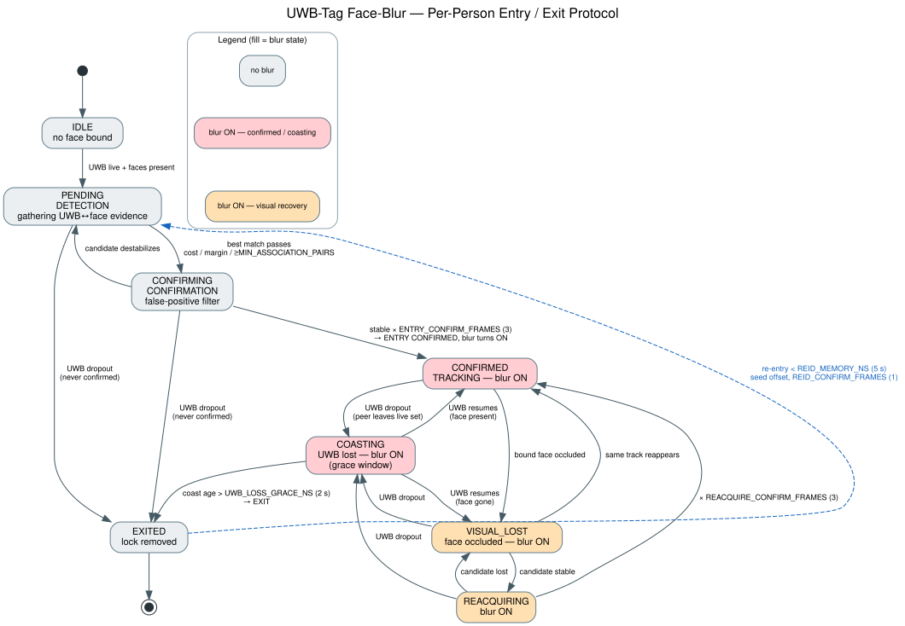
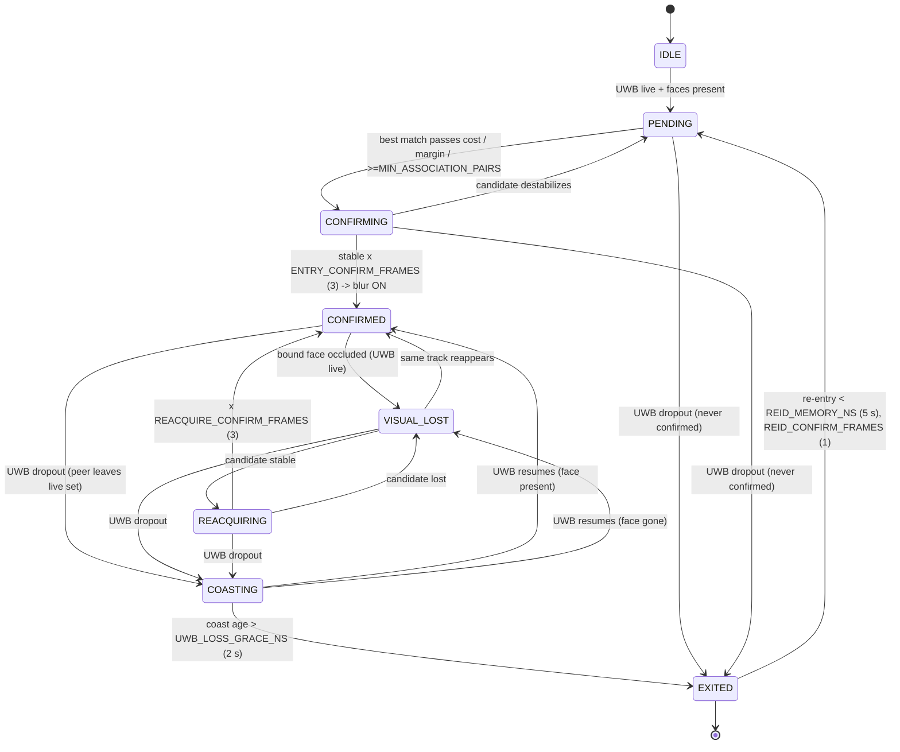

# Diagrams

## Entry / Exit Protocol (per tracked person)

State machine that governs how a UWB-tagged person is added to and removed from the face-blur
tracking system. Implemented in the `DWM3000_Android_tracker` submodule,
`FacePredictionTracker.kt` (`OwnerLockState`). See [../DATA_FLOW.md](../DATA_FLOW.md) for the full
narrative and requirements mapping.



Fill colour = blur state:
- **gray** — no blur (`IDLE`, `PENDING`, `CONFIRMING`, `EXITED`)
- **red** — blur ON, confirmed/coasting (`CONFIRMED`, `COASTING`)
- **amber** — blur ON, visual recovery (`VISUAL_LOST`, `REACQUIRING`)

### Files
| File | What |
|------|------|
| `entry_exit_protocol.dot` | Graphviz source (authoritative for the rendered image). |
| `entry_exit_protocol.svg` / `.png` | Rendered diagram (PNG is 140 dpi). |
| `entry_exit_protocol.mmd` | Mermaid source (renders inline on GitHub; mirrors `DATA_FLOW.md`). |

### Regenerate

```bash
cd diagrams
dot -Tsvg entry_exit_protocol.dot -o entry_exit_protocol.svg
dot -Tpng -Gdpi=140 entry_exit_protocol.dot -o entry_exit_protocol.png
```

(Graphviz `dot` only — no extra tooling needed.)

### Mermaid version (GitHub-rendered)


